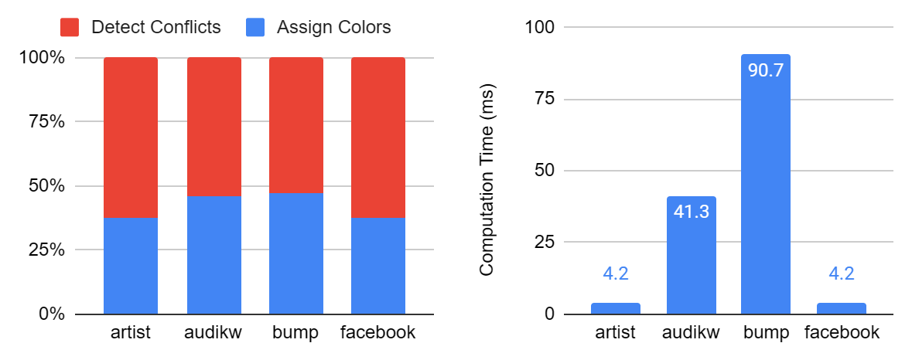
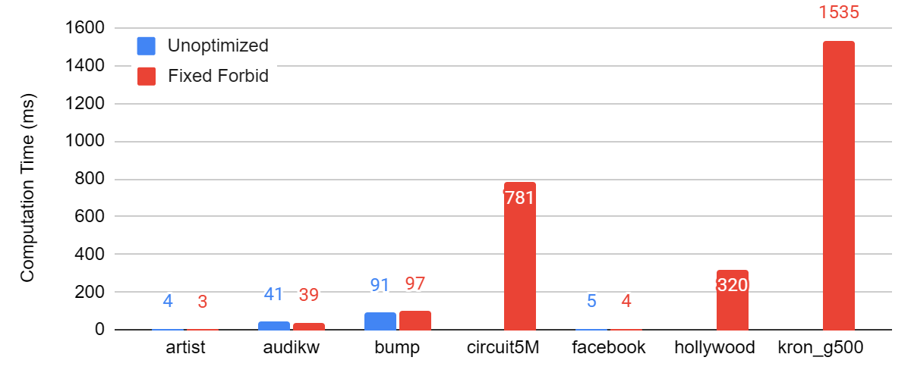
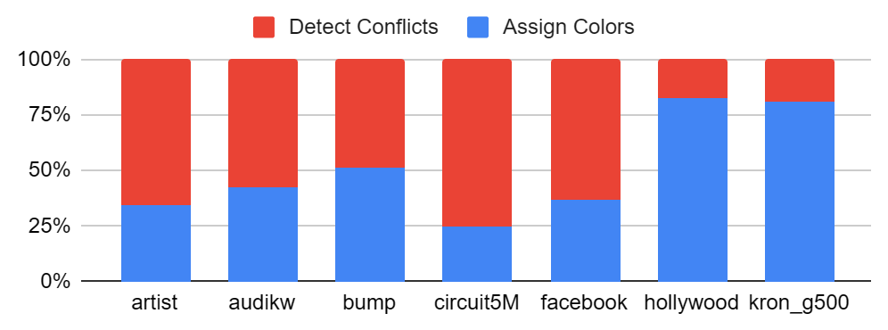
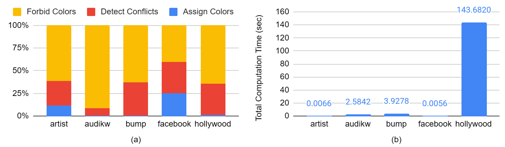
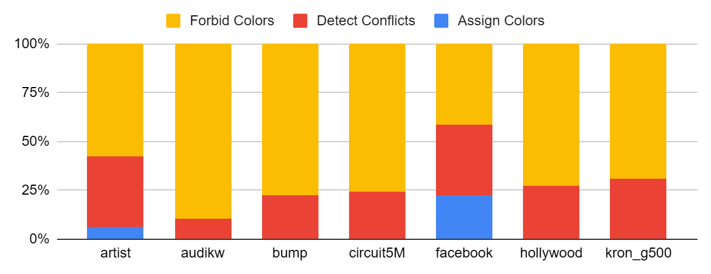
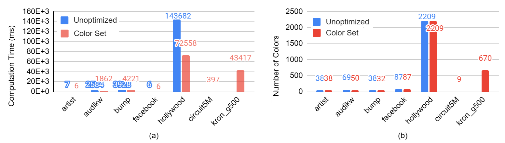
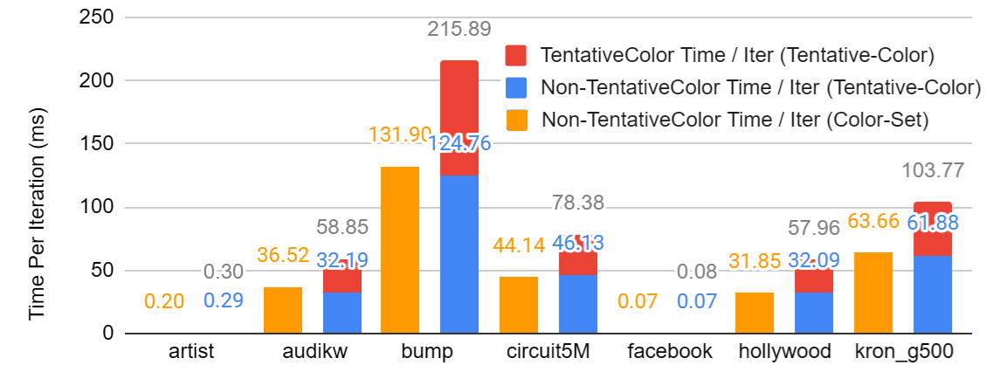
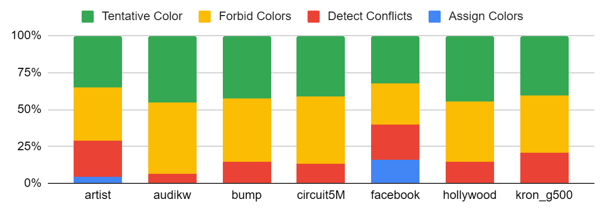
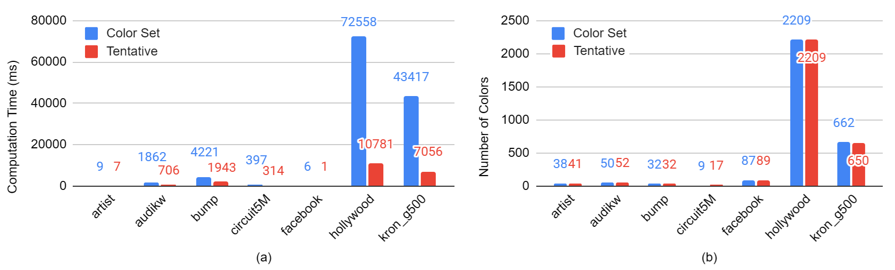
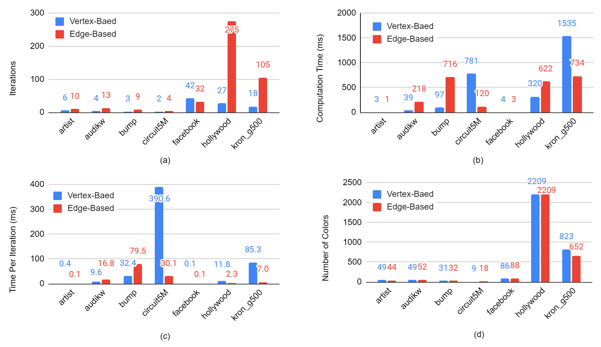

# Final Report

## 1. Summary

We implement two parallel graph coloring algorithms and optimizations thereto from [1]. These algorithms are designed for manycore architectures and we implement them on a GPU.

## 2. Background

Graph coloring is the assigning of labels – often represented as colors – to a graph. A graph is a network structure where individual nodes (also known as vertices) are connected by edges. In order for a graph coloring to be valid, no two nodes with the same color can be connected by an edge. The goal is to use a small set of labels to color the graph.

Graph coloring started out as a problem in pure mathematics. But since then, various applications have been found. The common application area is scheduling. In scheduling, a number of different jobs must be scheduled into time slots. But some jobs cannot be scheduled in the same time slot, often because of some shared resource. We can think of these jobs as a graph. Each job is a node. Jobs that cannot occupy the same time slot are connected by an edge. The labels are the time slots. This is often used in parallel computation where certain jobs cannot or should not be scheduled at the same time.

In graph coloring, there are two conflicting goals. First, one wants to use few colors, maybe even the fewest possible. A smaller number of colors means more parallelism between and therefore a smaller runtime. On the other hand, efficiency is an important goal. One does not want to waste too much time simply computing the graph. It may make sense to produce a suboptimal coloring if the time it would take to generate a perfect coloring would be much greater than the time saved. The balance between these two goals depends on the precise application.

## 3. Approach

We implement vertex- and edge- based approaches to graph coloring. The vertex based algorithm operates on vertices in parallel. The edge based algorithm operates on either edges or vertices in parallel at different points.

### 3.1 Vertex-Based Algorithms

In the vertex-based approach, we iteratively color and resolve conflicts. In each iteration, we start with a conflict list. On the first iteration, the conflict list contains all the vertices and on subsequent iterations, the conflict list contains any vertices which share colors with neighbors. In each iteration, we first call `AssignColors` which processes each vertex in the conflict list in parallel, assigning to each vertex the smallest color that is not used by one of its neighbors. Since this is done in parallel and the threads do not modify colors atomically, it is likely that some vertices will be colored the same as their neighbors.

Following `AssignColors`, `DetectConflicts` processes each vertex in the conflict list in parallel, detecting conflicts and uncoloring some vertices to resolve the conflicts. It adds these uncolored vertices to a new conflict list. On the next iteration, only the vertices in this new conflict list are processed. Notice that the conflict list gets smaller each iteration. The algorithm continues until the conflict list is empty.

```pseudocode
# Vertex Based Coloring
Color[v] ← 0 for all vertices v
Conf ← V
while Conf is not empty:
  AssignColors()
  Conf ← DetectConflicts()
```

```pseudocode
# AssignColors (Vertex-Based)
for v in Conf in parallel:
  forbidden ← false
  for u adjacent to v:
    Forbidden[Color[u]] ← true
  for i in range(max degree):
    if Forbidden[i] = false:
      Color[v] = i
      break
```

```pseudocode
# DetectConflicts (Vertex-Based)
NewConf ← empty set
for v in OldConf in parallel:
  for u adjacent to v:
    if Color[u] == Color[v] AND u < v:
      ATOMIC NewConf ← NewConf ∪ v
      break
return NewConf
```

The color list is simply stored as an array of numbers with the $n$th element indicating the color of vertex $n$.

In order to know adjacencies, the input includes an adjacency list. For each vertex, there is a sublist containing all adjacent vertices. In order to know where this sublist is in the adjacency list, the input includes an offsets list indicating where in the adjacency list each sublist starts with the nth element indicating the start of the adjacency sublist for vertex $n$.

#### 3.1.1 Maintaining Conflict List

In order to create the new conflict list, threads must atomically append vertices to a new conflict list. There are two methods for this atomic appending mentioned by [1]. First, one can use atomic fetch and add. In this method, one maintains a global variable storing the length of the list. To add to the list, use atomic fetch and add. This simultaneously fetches the position at which to insert an element and increases the list’s size. Notice that the space for the list must be allocated beforehand. Since we know that the conflict list can be no longer than the number of vertices, we simply allocate enough memory to hold the id of every vertex.

```pseudocode
# DetectConflicts (Vertex-Based, Atomic Fetch and Add)
NewConfLen ← 0
for v in Conf in parallel:
  for u adjacent to v:
    if Color[u] = Color[v] AND u < v:
      AppendLocation ← AtomicFetchAndAdd(NewConfLen)
      NewConf[AppendLocation] ← u
```

The second method uses a parallel prefix sum. In this method, we use a list of integers to mark which vertices are conflicts. We then use a parallel prefix to find the positions of these new conflicts within a conflict list. Finally, we use these positions to add the conflicts into a conflict list.

```pseudocode
# DetectConflicts (Vertex-Based, Parallel Prefix Sum)
NewConfPos ← [0, ..., 0] with length of V
for v in Conf in parallel:
  for u adjacent to v:
    if Color[u] = Color[v] AND u < v:
      NewConfPos[u] = 1
NewConfPos ← InclusiveParallelPrefixSum(NewConfPos)
NewConfLen ← NewConfPos[VerticesLen - 1]
for i in range(len(NewConfPos)):
  if (i==0 AND NewConfPos[i]==1) OR (i>0 AND NewConfPos[i] > NewConfPos[i-1]):
    NewConf[NewConfPos[i] - 1] = i
```

Unless otherwise stated, we use the atomic fetch and add method in our experiments.

#### 3.1.2 Memory & Fixed Forbidden Optimization

Another implementation issue is how to assign the lowest possible color to a vertex in `AssignColors`. In order to do this, each thread maintains a forbidden list. The nth element in the forbidden list represents whether color n is forbidden for the vertex. We initialize the forbidden array to false and iterate through all neighboring vertices, setting the colors of neighbors to true in the forbidden array. Since dynamic memory allocation is difficult on a GPU, the forbidden array for each vertex must be allocated statically. We put this forbidden array in shared memory since this makes memory access faster than in global memory. But unfortunately, this means we have to allocate huge amounts of shared memory. For each thread, we must allocate shared memory proportional to the max degree of the graph. That is obviously an absurd amount of memory and so we implement an optimization introduced by [1] in order to reduce memory requirements.

The fixed forbidden optimization introduces two changes. Firstly, rather than using an array of booleans, a bitmap is used with each bit representing whether a color is forbidden. This drastically reduces memory requirements.

The second change this optimization makes is to use a fixed size forbidden array. In `AssignColors`, we only check `MAXFORBID` colors at a time. Only if none of those colors are available do we check the next `MAXFORBID` colors. We set `MAXFORBID` to 64 and store Forbidden as a long unsigned integer.

```pseudocode
# AssignColors (Fixed Forbidden Optimization)
Allocate private Forbidden with size MAXFORBID for each vertex
for v in conflict list in parallel:
  Offset ← 0
  while v is not colored:
    Forbidden ← false
    for vertex u adjacent to v AND Offset <= Color[u] < Offset + MaxForbid:
      Forbidden[Color[u] - Offset] = true
Color[v] ← first available color or if no such color available, -1, representing no color
Offset ← Offset + MaxForbid
```

### 3.2 Edge Based Algorithms

A significant disadvantage of vertex based algorithms on GPUs is that high divergence between threads. Vertex based algorithms must examine the neighbors of each vertex but different vertices have different numbers of neighbors. This means the time a warp takes is determined by the maximum degree of vertices processed by threads in the warp, wasting a significant amount of computation in the other threads.

In edge based algorithms, most functions instead process edges, not vertices. Each edge connects exactly two vertices so there is much less divergence in execution path between threads.

The edge based algorithms are also iterative, continuing until all vertices are colored. In each iteration, we first parallelize over vertices and color each vertex with the first available color that is not forbidden for that vertex. Then, by parallelizing over edges, we detect any conflicts between vertices, and uncolor vertices to eliminate the conflicts. Finally, we parallelize over all edges to mark certain colors as forbidden for vertices with neighbors of those colors.

We store the forbidden colors for each vertex by storing a contiguous series of arrays of booleans. `VForbidden[v][n]` indicates whether vertex `v` is forbidden from being color `n`. We store the edges as a list of structs, each containing two the identities of two vertices. We store the colors similarly to beforehand. Since we process all vertices in every iteration, we no longer store a list of vertices; we only store the total number of vertices and information about each vertex in the `Color` and `VForbidden` arrays.

```pseudocode
# Edge-Based Graph Coloring
Set VForbidden[v] = 0 for all vertices v
while there exists a vertex that is not colored
  AssignColors(V, VForbidden, Color)
  DetectConflicts(E, Color)
  ForbidColors(E, Color, VForbidden)
```

```pseudocode
# AssignColors (Edge-Based)
for vertex v in parallel:
  for c in range (0, MaxColor):
    if VForbidden[v] == false:
      Color[v] ← c
      break
```

```pseudocode
# DetectConflicts (Edge-Based)
for edge e = (v1, v2) in E in parallel:
  If Color[v1] != Color[v2]:
    return;
  Color[min(v1, v2)] ← -1
```

```pseudocode
# ForbidColors (Edge-Based)
for edge e = (v1, v2) in E in parallel:
  if v1 is not colored:
    VForbidden[v2][Color[v1]] ← true
  if v2 is not colored:
    VForbidden[v1][Color[v2]] ← true
```

Unfortunately, the initial edge based algorithm has significant problems in practice so [1] introduces further optimizations.

#### 3.2.1 Color Set Optimization

The first issue with the edge-based algorithm is memory usage. Just like the vertex based algorithm, storing the forbidden colors for each vertex takes up huge amounts of memory. To solve this, we employ a similar strategy to that used in the fixed forbidden optimization of the vertex based algorithm.

We store the forbidden arrays as bitmaps instead of arrays. And again like the fixed forbidden optimization, instead of storing the entirety of the forbidden array at once, we only store a slice of it, examining only a subset of colors at once.

In addition to storing the forbidden array differently, we also store the color of each vertex differently. The color is stored as a one-hot 32-bit vector. Color 1 is represented with the least significant bit, color 2 is represented with the second least significant bit, and so on. A lack of color is represented with all zeros. In order to keep track of colors more than 32, we also keep track of a color set. A vertex with color `n` would have a `ColorSet` of `floor(n/32)` and a Color with the bit `n % 32` set. Notice that `VForbidden `only covers the 32 colors encompassed by the current color set. Notice that we store non-colored vertices as color 0 instead of color -1 as in the vertex based algorithms and the unoptimized edge-based algorithm.

This strategy of storing colors and forbidden colors has several benefits. Firstly, with this optimization, storing all color information requires only 12 bytes for each vertex (4 bytes for the color set, and 4 bytes for the color itself, 4 bytes for forbidden colors). Secondly, storing the color as a one-hot vector and the forbidden colors as a bitmap allows one to efficiently modify the forbidden bitmap by using bitwise or.

```pseudocode
# AssignColors (Color Set Optimization)
For vertex v in parallel:
  if Color[v] is not all zeros (i.e. v is colored):
    return;
  if VForbidden[v] has at least one bit set to 0:
    Color[v] = FirstAvailableBit(VForbidden[v])
  else:
    ColorSet[v] ← ColorSet(v) + 1
    VForbidden[v] ← 0
```

```pseudocode
# DetectConflicts (Color Set Optimization)
for edge e = (v1, v2) in E in parallel:
  if Color[v1] != Color[v2] or ColorSet[v1] != ColorSet[v2]:
    return
  Color[min(v1, v2)] ← 0
```

```pseudocode
# ForbidColors (Color Set Optimization)
for edge e = (v1, v2) in E in parallel:
  if ColorSet(v1) != ColorSet(v2):
    return
  if v1 is colored AND v2 is not colored:
    atomic: VForbidden[v2] ← VForbidden[v2] | Color[v1]
  if v2 is colored AND v1 is not colored:
    atomic: VForbidden[v1] ← VForbidden[v1] | Color[v2]
```

####  3.2.2 Tentative Coloring Optimization

In the penultimate optimization, we tentatively assigned colors to nodes in order to reduce the number of iterations that the algorithm ran for. If a vertex is colored at the end of an iteration following `DetectConflicts` and `ForbidColored`, its color should never be changed. But if a vertex is tentatively colored at the end of an iteration, this does not hold. A tentatively colored vertex may change its coloring. We refer to a non-tentative coloring as a solid coloring.

`TentativeColor` is called at the end of each iteration. When it encounters an edge where both vertices are not colored, it tentatively colors one of them. Mirroring `DetectConflicts` and `ForbidColors`, `TentativeColor` also resolves conflicts between tentative vertices and marks certain colors as tentatively forbidden in `TVForbidden`. Upon the next iteration, `AssignColors` will convert the tentatively colored vertices to a solidly colored vertex. As before, if this results in conflicts, `DetectConflicts` uncolors the vertices, But if a vertex coloring survives, then the color is finalized. Details are presented in the psuedocode.

We store tentative colorings using the same `Color` list. We use a hot encoding as before but we use the first bit as a sign bit. If vertex `v` is colored tentative, then the highest bit in `Color[v]` is set to one. Otherwise, it is left at zero. In the pseudo code below, we represent tentative colors as negative and solid colors as positive. This scheme has the side effect that only 31 tentative colors and 31 solid can be distinguished in the `Color`. So each color set represents a range of 31 colors, not 32. Since each color set only covers 31 colors, elements of `TVForbidden` and `VForbidden` are each represented with 31 bits. In practice, we use 32 bit integers with the first bit always set.

We initially implemented the tentative coloring optimization as presented in [1] but we found that the algorithm does not terminate on some graphs. We prove this using a simple example graph in the appendix.

```pseudocode
# Edge-Based Graph Coloring (Tentative Coloring Optimization)
Set VForbidden[v] = 0 for all vertices v
while there exists a vertex that is not colored
  AssignColors(V, VForbidden, Color, ColorSet)
  DetectConflicts(E, Color, ColorSet)
  ForbidColors(E, VForbidden, Color, ColorSet)
  TentativeColor(E, VForbidden, TVForbidden, Color, ColorSet)
```

```pseudocode
AssignColors (Tentative Coloring Optimization)
for vertex v in parallel:
  if v is tentatively colored:
    Color[v] ← -Color[v]
  if v is not colored:
    AllForbid ← VForbidden[v] | TVForbidden[v]
    if AllForbid has bits set to 0:
      Color[v] ← FirstAvailableBit(AllForbid)
    else:
      ColorSet[v] ← ColorSet[v] + 1
      VForbidden ← 0
      TVForbidden ← 0
```

```pseudocode
# DetectConflicts (Tentative Coloring Optimization)
for edge e = (v1, v2) in E in parallel:
  if v1 is solidly colored AND Color[v1] == Color[v2] AND ColorSet[v1] == ColorSet[v2]:
    if v1 < v2:
      Color[v1] ← 0
    else:
      Color[v2] ← 0
```

```pseudocode
# ForbidColors (Tentative Coloring Optimization)
for edge e = (v1, v2) in E in parallel:
  if ColorSet(v1) != ColorSet(v2):
    return
  if v1 is solidly colored AND v2 is not solidly colored:
    atomic: VForbidden[v2] ← VForbidden[v2] | Color[v1]
  if v2 is solidly colored AND v1 is not solidly colored:
    atomic: VForbidden[v1] ← VForbidden[v1] | Color[v2]
```

```pseudocode
# TentativeColor (Tentative Coloring Optimization)
for edge e = (v1, v2) in E in parallel:
  if ColorSet[v1] != ColorSet[v2]:
    return
  minVertex = min(v1, v2)
  maxVertex = max(v1, v2)
  if minVertex is not colored and maxVertex is not colored:
    AllForbid ← VForbidden[maxVertex] | VForbidden[minVertex]
    TempColor ← firstZeroBit(AllForbid)
    Color[maxVertex] = -TempColor
    atomic: TVForbidden[minVertex] ← TV[minVertex] | TempColor
  else if minVertex is tentatively colored AND maxVertex is not colored:
    atomic: TVForbidden[maxVertex] ← TVForbidden[maxVertex] | -Color[minVertex]
  else if maxVertex is tentatively colored AND minVertex is not colored:
    atomic: TVForbidden[minVertex] | -Color[maxVertex]
  else if (minVertex is tentatively colored AND maxVertex is tentatively colored AND Color[minVertex] = Color[maxVertex]):
    AllForbid ← VForbidden[minVertex] | TVForbidden[minVertex]
    TempColor ← firstZeroBit(AllForbid)
    Color[minVertex] ← -TempColor
    atomic: TVForbidden[maxVertex] ← TVForbidden[maxVertex] | TempColor
```

#### 3.2.3 Edge Removal Optimization

In the final optimization, we remove edges from the edge list which we know will not need to be examined in future iterations. Without this optimization, on large graphs, there may be more threads than the GPU can run at once. But by reducing the number of edges in each iteration, we allow a larger proportion of threads to run, and therefore increase parallelism.

We remove any edges where both vertices are colored. If two vertices remain colored after `DetectConflicts` and `ForbidColors`, then the colors are finalized and there will be no further conflicts between the vertices. And so, we can safely ignore the edge in subsequent iterations.

We also remove any edges where one vertex is colored and the other is not and both are in the same color set. In such a case, `ForbidColors` guarantees that the non-colored vertex will never be colored by `AssignColors` with the color of the colored vertex. Therefore, there will be no conflicts between the vertices, and we can safely remove the edge.

We additionally remove any edges where one vertex is colored and the other is not and the colored vertex has a color set lower than the non-colored vertex. The colored vertex has already survived `DetectConflicts` and so its color and color set will not change. And the color set of the non-colored vertex will never decrease. Therefore, the vertices will never have the same color set and will therefore never have a conflict. So, the edge can be discarded for future iterations.

Similarly to the conflict list in the vertex-based algorithms, the edge list can be maintained either with `AtomicAdd` or with a parallel prefix sum.

```pseudocode
# Edge-Based Graph Coloring (Edge Removal Optimization)
Set VForbidden[v] = 0 for all vertices v
while there exists a vertex that is not colored
  AssignColors(V, VForbidden, Color, ColorSet)
  DetectConflicts(E, Color, ColorSet)
  ForbidColors(E, VForbidden, Color, ColorSet)
  CreateNewEdges(E)
  TentativeColor(E, VForbidden, TVForbidden, Color, ColorSet)
```

```pseudocode
# CreateNewEdges (Edge Removal Optimization)
NewEdges ← ∅
for edge e = (v1, v2) in E in parallel:
  if v1 is not colored and v2 is not colored:
    break
  if v1 is not colored AND v2 >= v1 AND ColorSet[v2] <= ColorSet[v1]:
    break;
  if v2 is not colored AND v1 >= v2 AND ColorSet[v1] <= ColorSet[v2]:
    break;
  ATOMIC NewEdges ← NewEdges ∪ e
E ← NewEdges
```

## 4. Results

### 4.1 Experimental Design

We use 2 graphs from [Stanford Large Network Dataset Collection](https://snap.stanford.edu/data/) (*facebook* [2], *artist* [3]). They originated from large social and information networks.

Following [1], we also use graphs from the UFL Sparse Matrix Collection [4]. The dataset contains large sparse matrices that arise in various real applications. We consider a matrix as an adjacency matrix of a graph, ignoring the numerical value of non-zero elements. When solving problems involving these large matrices, parallel algorithms are often used, and conflicts are common. Graph coloring is a good algorithm to resolve conflict when assigning work to computation cores/nodes. So, our work plays an important role in preprocessing steps in these real problems.

Limited by the storage size of GHC machines, we choose 5 graphs (matrices) from the UFL Sparse Matrix Collection (*audikw*, *bump*, *circuit5M*, *hollywood*, *kron_g500*), each of which has about 1M vertices and 50M edges. They have different maximum degrees, sizes, and overall structures. As expected, computation time on them varies.

| Graphs      | # of Vertices | # of Edge  | Average Degree | Max Degree |
| ----------- | ------------- | ---------- | -------------- | ---------- |
| *artist*    | 50,515        | 819,306    | 32             | 1,469      |
| *audikw*    | 943,695       | 38,354,076 | 81             | 344        |
| *bump*      | 2,911,419     | 62,409,240 | 43             | 194        |
| *circuit5M* | 5,558,326     | 53,967,844 | 19             | 1,290,500  |
| *facebook*  | 4039          | 88,234     | 44             | 1,045      |
| *hollywood* | 1,139,905     | 56,375,711 | 99             | 11,467     |
| *kron_g500* | 2,097,152     | 91,040,932 | 87             | 213,904    |

Our primary metric is total runtime on each graph. Graphs differ in much more than size and so metrics like "milliseconds per vertex" or "milliseconds per edge" are not particularly useful. We also measure the number of iterations and time per iteration in order to ascertain when differences in runtime are due to differences in the number of iterations and when they are due to differences in the runtime of each iteration. Additionally, we measured the number of colors used as the goal of graph coloring is a small number of colors.

Unless otherwise specified, experiments with vertex-based algorithms are performed with a block size of 1 and experiments with edge-based algorithms are performed with a block size of 1024. These were found to be the best block sizes for their respective algorithm types.

In all experiments, we use atomic fetch and add to atomically append to lists.

### 4.2 Vertex Based Algorithm Optimization

#### 4.2.1 Unoptimized

As detailed in subsequent sections, the unoptimized vertex-based algorithm has significant issues. One of these is that many large graphs cannot be run on with the unoptimized vertex-based algorithm on the GHC machines due to the large memory requirements.

We find that a majority of runtime is spent in `DetectConflicts` on all tested graphs.



**Figure**: Computation time of unoptimized vertex-based algorithm on 4 graphs. The left one shows time split between `DetectConflicts` and `AssignColors`; the right one shows the total computation time.

#### 4.2.2 Fixed Forbidden Optimization

Without the fixed forbidden optimization, memory errors prevented us from processing certain large graphs. The unoptimized vertex-based algorithm resulted in out of memory errors from CUDA when run with several graphs. This occurs because, in the unoptimized vertex-based algorithm, each thread requires enormous amounts of shared memory to keep track of forbidden colors. For some graphs, the unoptimized algorithm can be run with small block sizes but not large block sizes, presumably because higher memory requirements in a block can exceed the memory limits for a block.

We find that with the fixed forbidden optimization, overall runtime and per-iteration runtime is generally smaller. Recall that without the fixed forbidden optimization, threads must iterate through a long list of forbidden colors. We speculate that the lack of need to iterate through these colors when the fixed forbidden optimization is applied reduces runtime. 



**Figure**: Comparison between the total computation time with and without the Fixed Forbidden optimization.


<table>
    <tr>
        <td> </td>
        <td colspan="2" align="center" style="font-weight: bold">Total Computation Time (Sec)</td>
        <td colspan="2" align="center" style="font-weight: bold">Iterations</td>
        <td colspan="2" align="center" style="font-weight: bold">Time Per Iteration (Sec)</td>
    </tr>
    <tr>
        <td></td>
        <td>Unoptimized</td>
        <td>Fixed Forbid</td>
        <td>Unoptimized</td>
        <td>Fixed Forbid</td>
        <td>Unoptimized</td>
        <td>Fixed Forbid </td>
    </tr>
    <tr>
        <td style="font-style: italic">artist</td>
        <td>0.00395</td>
        <td>0.00254</td>
        <td>4</td>
        <td>6</td>
        <td>0.00099</td>
        <td>0.00042 </td>
    </tr>
    <tr>
        <td style="font-style: italic">audikw</td>
        <td>0.04135</td>
        <td>0.03854</td>
        <td>3</td>
        <td>4</td>
        <td>0.01378</td>
        <td>0.00964 </td>
    </tr>
    <tr>
        <td style="font-style: italic">bump</td>
        <td>0.09074</td>
        <td>0.09722</td>
        <td>3</td>
        <td>3</td>
        <td>0.03025</td>
        <td>0.03241 </td>
    </tr>
    <tr>
        <td style="font-style: italic">circuit5M</td>
        <td>N/A</td>
        <td>0.78115</td>
        <td>N/A</td>
        <td>2</td>
        <td>N/A</td>
        <td>0.39057 </td>
    </tr>
    <tr>
        <td style="font-style: italic">facebook</td>
        <td>0.00487</td>
        <td>0.00372</td>
        <td>56</td>
        <td>42</td>
        <td>0.000087</td>
        <td>0.000088 </td>
    </tr>
    <tr>
        <td style="font-style: italic">hollywood</td>
        <td>N/A</td>
        <td>0.31952</td>
        <td>N/A</td>
        <td>27</td>
        <td>N/A</td>
        <td>0.01183 </td>
    </tr>
    <tr>
        <td style="font-style: italic">kron_g500</td>
        <td>N/A</td>
        <td>1.53450</td>
        <td>N/A</td>
        <td>18</td>
        <td>N/A</td>
        <td>0.08525</td>
    </tr>
</table>

We find that on most graphs, a majority of runtime is spent in `DetectConflicts`. We further find that on *hollywood* and *kron_g500*, `AssignColors` dominates by a large margin. Notice that in both of these graphs, the number of colors is high, meaning that `AssignColors` must iterate through many color sets in order to find colors, which may explain why `AssignColors` dominates the runtime on these graphs.



**Figure**: time split with the Fixed Forbidden optimization.

We find no significant difference in the number of colors between the results produced with and without the fixed forbidden optimization.

**Table**: Number of Colors between the Results Produced with and without the Fixed Forbidden Optimization

|             | Unoptimized | Fixed Forbid |
| ----------- | ----------- | ------------ |
| *artist*    | 42          | 49           |
| *audikw*    | 49          | 49           |
| *bump*      | 31          | 31           |
| *circuit5M* | N/A         | 9            |
| *facebook*  | 92          | 86           |
| *hollywood* | N/A         | 2,209        |
| *kron_g500* | N/A         | 823          |

### 4.3 Edge Based Algorithms Optimization

#### 4.3.1 Unoptimized

As detailed in the subsequent sections, the unoptimized edge-based algorithm has significant issues. This includes the inability to run it on some large graphs on the GHC machines due to high memory requirements.

We find that on most graphs, a majority of the runtime is taken up by `ForbidColors`.



**Figure**: Computation time with unoptimized edge-based algorithm (a) shows time split between different steps; (b) shows total computation time.

See subsequent sections for further analysis of runtime and the number of colors used.

#### 4.3.2 Color Set Optimization

Mirroring the results of the fixed forbidden optimization, we found that without the color set optimization, out of memory errors were often produced with large graphs and we were unable to test the algorithm on such graphs. Similar to the unoptimized vertex-based algorithm, the unoptimized edge-based algorithm uses enormous amounts of memory to keep track of forbidden colors for each vertex.

Because the forbidden list was stored in global memory in the edge-based algorithms, block size had no effect on the production of memory errors as it did in the unoptimized vertex-based algorithm.

<table>
    <tr align="center">
        <td></td>
        <td colspan="2" align="center" style="font-weight: bold">Total Computation Time (Sec)</td>
        <td colspan="2" align="center" style="font-weight: bold">Iterations</td>
        <td colspan="2" align="center" style="font-weight: bold">Time Per Iteration (Sec)</td>
    </tr>
    <tr>
        <td></td>
        <td>Unoptimized</td>
        <td>Fixed Forbid</td>
        <td>Unoptimized</td>
        <td>Fixed Forbid</td>
        <td>Unoptimized</td>
        <td>Fixed Forbid</td>
    </tr>
    <tr>
        <td style="font-style: italic">artist </td>
        <td>0.00395 </td>
        <td>0.00254 </td>
        <td>4 </td>
        <td>6 </td>
        <td>0.00099 </td>
        <td>0.00042 </td>
    </tr>
    <tr>
        <td style="font-style: italic">audikw </td>
        <td>0.04135 </td>
        <td>0.03854 </td>
        <td>3 </td>
        <td>4 </td>
        <td>0.01378 </td>
        <td>0.00964 </td>
    </tr>
    <tr>
        <td style="font-style: italic">bump </td>
        <td>0.09074 </td>
        <td>0.09722 </td>
        <td>3 </td>
        <td>3 </td>
        <td>0.03025 </td>
        <td>0.03241 </td>
    </tr>
    <tr>
        <td style="font-style: italic">circuit5M </td>
        <td>N/A </td>
        <td>0.78115 </td>
        <td>N/A </td>
        <td>2 </td>
        <td>N/A </td>
        <td>0.39057 </td>
    </tr>
    <tr>
        <td style="font-style: italic">facebook </td>
        <td>0.00487 </td>
        <td>0.00372 </td>
        <td>56 </td>
        <td>42 </td>
        <td>0.00009 </td>
        <td>0.00009 </td>
    </tr>
    <tr>
        <td style="font-style: italic">hollywood </td>
        <td>N/A </td>
        <td>0.31952 </td>
        <td>N/A </td>
        <td>27 </td>
        <td>N/A </td>
        <td>0.01183 </td>
    </tr>
    <tr>
        <td style="font-style: italic">kron_g500 </td>
        <td>N/A </td>
        <td>1.53450 </td>
        <td>N/A </td>
        <td>18 </td>
        <td>N/A </td>
        <td>0.08525 </td>
    </tr>
</table>
We found that on most graphs, a majority of runtime is spent in `ForbidColors` just as in the unoptimized algorithm.



**Figure**: time split between different steps with the Color Set optimization.

The number of colors did not significantly change with the color set optimization applied.



**Figure**: comparison between algorithm with and without the Color Set optimization. (a) compares computation time; (b) compares number of colors.

#### 4.3.3 Tentative Coloring Optimization

Using tentative coloring generally resulted in decreased runtime. This decrease in runtime is clearly ascribable to a decrease in the number of iterations. As shown in charts below, the number of iterations was significantly smaller when using tentative optimization on most graphs. This can be attributed to the fact that with the tentative coloring optimization `AssignColor` will apply a solid color to tentatively colored vertices, resulting in vertices getting colored at an earlier point than they otherwise would be.

Nonetheless, tentative coloring did increase the time per iteration. We found this rise could be ascribed to time spent in the `TentativeColor` kernel. We found that the computation time per iteration spent outside of `TentativeColor` did not change significantly with the tentative coloring optimization.

<table>
    <tr>
        <td></td>
        <td colspan="2" align="center" style="font-weight: bold">Computation Time</td>
        <td colspan="2" align="center" style="font-weight: bold">Non-TentativeColor Time</td>
        <td colspan="2" align="center" style="font-weight: bold">TentativeColor Time</td>
        <td colspan="2" align="center" style="font-weight: bold">Iterations</td>
    </tr>
    <tr>
        <td></td>
        <td>Color Set</td>
        <td>Tentative</td>
        <td>Color Set</td>
        <td>Tentative</td>
        <td>Color Set</td>
        <td>Tentative</td>
        <td>Color Set</td>
        <td>Tentative </td>
    </tr>
    <tr>
        <td style="font-style: italic">artist</td>
        <td>0.00857</td>
        <td>0.00701</td>
        <td>0.00857</td>
        <td>0.00659</td>
        <td>\</td>
        <td>0.000425726</td>
        <td>42</td>
        <td>23 </td>
    </tr>
    <tr>
        <td style="font-style: italic">facebook</td>
        <td>0.00579</td>
        <td>0.00149</td>
        <td>0.00579</td>
        <td>0.00124</td>
        <td>\</td>
        <td>0.000248388</td>
        <td>89</td>
        <td>19 </td>
    </tr>
    <tr>
        <td style="font-style: italic">audikw</td>
        <td>1.86240</td>
        <td>0.70625</td>
        <td>1.86240</td>
        <td>0.38633</td>
        <td>\</td>
        <td>0.319922</td>
        <td>51</td>
        <td>12 </td>
    </tr>
    <tr>
        <td style="font-style: italic">bump</td>
        <td>4.22084</td>
        <td>1.94302</td>
        <td>4.22084</td>
        <td>1.12288</td>
        <td>\</td>
        <td>0.820136</td>
        <td>32</td>
        <td>9 </td>
    </tr>
    <tr>
        <td style="font-style: italic">circuit5M</td>
        <td>0.39724</td>
        <td>0.31352</td>
        <td>0.39724</td>
        <td>0.18452</td>
        <td>\</td>
        <td>0.128999</td>
        <td>9</td>
        <td>4 </td>
    </tr>
    <tr>
        <td style="font-style: italic">hollywood</td>
        <td>72.55820</td>
        <td>10.78090</td>
        <td>72.55820</td>
        <td>5.96886</td>
        <td>\</td>
        <td>4.81204</td>
        <td>2278</td>
        <td>186 </td>
    </tr>
    <tr>
        <td style="font-style: italic">kron_g500</td>
        <td>43.41730</td>
        <td>7.05623</td>
        <td>43.41730</td>
        <td>4.20758</td>
        <td>\</td>
        <td>2.84865</td>
        <td>682</td>
        <td>68</td>
    </tr>
</table>


**Figure**: comparison between non-`TentativeColor` time per iteration between the Color-Set algorithm and the optimized Tentative-Color algorithm.



**Figure**: time split between different steps with the Tentative-Color optimization.

Although the Tentative Color Optimization reduces the total computational time, it has no significant effect on the number of colors.



**Figure**: comparison between algorithm with and without the Tentative-Color optimization. (a) compares computation time; (b) compares number of colors.

#### 4.3.4 Edge Removal Optimization

Our edge removal optimization resulted in a significant decrease in runtime. While the number of iterations increased with some graphs, the average time per iteration decreased significantly.
<table>
    <tr>
        <td> </td>
        <td colspan="2" align="center" style="font-weight: bold">Total Computation Time</td>
        <td colspan="2" align="center" style="font-weight: bold">Iterations</td>
        <td colspan="2" align="center" style="font-weight: bold">Time Per Iteration</td>
    </tr>
    <tr>
        <td></td>
        <td>Tentative</td>
        <td>Edge Removal</td>
        <td>Tentative</td>
        <td>Edge Removal</td>
        <td>Tentative</td>
        <td>Edge Removal </td>
    </tr>
    <tr>
        <td style="font-style: italic">artist</td>
        <td>0.00701</td>
        <td>0.00124</td>
        <td>23</td>
        <td>10</td>
        <td>0.00030</td>
        <td>0.00012 </td>
    </tr>
    <tr>
        <td style="font-style: italic">audikw</td>
        <td>0.70625</td>
        <td>0.21779</td>
        <td>12</td>
        <td>13</td>
        <td>0.05885</td>
        <td>0.01675 </td>
    </tr>
    <tr>
        <td style="font-style: italic">bump</td>
        <td>1.94302</td>
        <td>0.71590</td>
        <td>9</td>
        <td>9</td>
        <td>0.21589</td>
        <td>0.07954 </td>
    </tr>
    <tr>
        <td style="font-style: italic">circuit5M</td>
        <td>0.31352</td>
        <td>0.12029</td>
        <td>4</td>
        <td>4</td>
        <td>0.07838</td>
        <td>0.03007 </td>
    </tr>
    <tr>
        <td style="font-style: italic">facebook</td>
        <td>0.00149</td>
        <td>0.00281</td>
        <td>19</td>
        <td>32</td>
        <td>0.00008</td>
        <td>0.00009 </td>
    </tr>
    <tr>
        <td style="font-style: italic">hollywood</td>
        <td>10.78090</td>
        <td>0.62201</td>
        <td>186</td>
        <td>275</td>
        <td>0.05796</td>
        <td>0.00226 </td>
    </tr>
    <tr>
        <td style="font-style: italic">kron_g500</td>
        <td>7.05623</td>
        <td>0.73351</td>
        <td>68</td>
        <td>105</td>
        <td>0.10377</td>
        <td>0.00699</td>
    </tr>
</table>
We find that the most of the runtime is spent in `CreateNewEdgeList`, `TentativeColor`, and `ForbidColors`.

****

To investigate this difference in runtime, we run the algorithm with and without the edge-removal optimization on the *kron_g500* graph and profile `orbidColors` with Nsight Compute. We find the difference in runtime is due to the fact that without the edge removal optimization, there are far more threads than the GPU can run simultaneously. Notice that with and without the edge removal optimization, the number of active warps per SM stays approximately the same through most iterations. But the total number of edges in the edge list and therefore the total number of warps, plummets when the edge removal optimization is applied after only the first few iterations. Since the number of active warps is the same in both algorithms but the total number of warps is much less with the edge removal optimization, it takes significantly fewer cycles to complete the work in all blocks. 

Note that the data in the charts below were collected with Nsight Compute and so the runtimes significantly are inflated due to overhead from profiling.


The edge removal optimization lead to no significant change in the number of colors


### 4.4 Edge-Based and Vertex-Based Algorithms Compared

We found that neither the fully optimized vertex-based algorithm nor the fully-optimized edge-based algorithm produced consistently better runtimes. Rather, the runtimes varied significantly between graphs. But the trends become clearer when looking at the number iterations and the time per iteration. 

We found that edge-based graph coloring consistently used more iterations than vertex-based graph coloring (with the sole exception of the *facebook* graph). Since both algorithms end when there are no more conflicts, this indicates that conflicts are more likely to be introduced or survive on an iteration of the edge-based algorithm. Recall that in vertex-based algorithms, forbidding colors and assigning colors are both done in `AssignColors`. This means that one thread may see the coloring of a neighbor assigned by another thread in the same iteration, leading to a potential conflict being avoided. Conflict this with an edge based algorithm where `ForbidColors` and `AssignColors` are two separate kernels. This means that when forbidding colors, a thread cannot “look ahead” and see how other threads are assigning colors as color assignment has not yet started.

We noticed that the time per iteration correlated strongly with the max degree. The only graphs where the edge-based algorithm had lower time per iteration than the vertex-based algorithm were the graphs with the lowest max degrees. Recall that in vertex-based algorithms, threads must iterate through all neighbors of a vertex. This means that a single vertex with many neighbors can slow down the entire iteration. So it follows that graphs with high maximum degrees have high runtime on each iteration.



**Figure**: Comparison between optimized vertex-based and edge-based algorithms. (a) compares the number of iterations to converge; (b) compares the total computation time; (c) compares the computation time per iteration; (d) compares the number of colors in the output graphs.

We find no consistent difference in the number of colors. On most graphs, the numbers of colors are similar. The exceptions are circuit5M where edge-based coloring doubles the number of colors and *kron_g500* where vertex based coloring increases the number of colors significantly.

<table>
    <tr>
        <td> </td>
        <td colspan="2" align="center" style="font-weight: bold">Total Computation Time (Sec)</td>
        <td colspan="2" align="center" style="font-weight: bold">Iterations</td>
        <td colspan="2" align="center" style="font-weight: bold">Time Per Iteration</td>
        <td rowspan="2" align="center" valign="center" style="font-weight: bold">Max Degree</td>
    </tr>
    <tr>
        <td></td>
        <td>Vertex-Based</td>
        <td>Edge-Based</td>
        <td>Vertex-Baed</td>
        <td>Edge-Based</td>
        <td>Vertex-Baed</td>
        <td>Edge-Based</td>
    </tr>
    <tr>
        <td style="font-style: italic">artist</td>
        <td>0.00254</td>
        <td>0.00124</td>
        <td>6</td>
        <td>10</td>
        <td>0.00042</td>
        <td>0.00012</td>
        <td>1,469 </td>
    </tr>
    <tr>
        <td style="font-style: italic">audikw</td>
        <td>0.03854</td>
        <td>0.21779</td>
        <td>4</td>
        <td>13</td>
        <td>0.00964</td>
        <td>0.01675</td>
        <td>344 </td>
    </tr>
    <tr>
        <td style="font-style: italic">bump</td>
        <td>0.09722</td>
        <td>0.71590</td>
        <td>3</td>
        <td>9</td>
        <td>0.03241</td>
        <td>0.07954</td>
        <td>194 </td>
    </tr>
    <tr>
        <td style="font-style: italic">circuit5M</td>
        <td>0.78115</td>
        <td>0.12029</td>
        <td>2</td>
        <td>4</td>
        <td>0.39057</td>
        <td>0.03007</td>
        <td>1,290,500 </td>
    </tr>
    <tr>
        <td style="font-style: italic">facebook</td>
        <td>0.00372</td>
        <td>0.00281</td>
        <td>42</td>
        <td>32</td>
        <td>0.000088</td>
        <td>0.000088</td>
        <td>1,045 </td>
    </tr>
    <tr>
        <td style="font-style: italic">hollywood</td>
        <td>0.31952</td>
        <td>0.62201</td>
        <td>27</td>
        <td>275</td>
        <td>0.01183</td>
        <td>0.00226</td>
        <td>11,467 </td>
    </tr>
    <tr>
        <td style="font-style: italic">kron_g500</td>
        <td>1.53450</td>
        <td>0.73351</td>
        <td>18</td>
        <td>105</td>
        <td>0.08525</td>
        <td>0.00699</td>
        <td>213,904</td>
    </tr>
</table>

### 4.5 Block Size

#### 4.5.1 Block Size in Vertex-Based Algorithms

In vertex-based algorithms, block sizes can have very different effects on runtime depending on the graph. On most graphs, a block size of 1 produced the best runtime but this was not universally true. There is also no consistent trend in the number of iterations or the runtime per iteration.

The per-iteration runtime on some graphs like bump and audikw seem to fall as block size increases and then plateau after reaching a block size of 32. We suspect that this is because, with a block size smaller than 32, there are not enough threads to fill up a 32 thread warp, significantly limiting parallelism.

For many other graphs, the per-iteration runtime increases until reaching a block size of 32 and then plateaus. We also suspect that this can also be explained by limited parallelism in warps. In the vertex-based algorithm, a thread must iterate through all the neighbors of its assigned vertex. Since different vertices processed in the same warp can have different numbers of neighbors, this means that some threads must wait on others to complete. A larger number of threads per warp amplifies this effect, meaning that higher block sizes can lead to higher per-iteration runtimes in the range [1, 32]. This also explains why a block size of one generally performs best on most graphs.

On graphs with high variance in the number of neighbors per vertex, runtime is likely to increase with block size in the range [1, 32]. But on graphs with little variance in the number of neighbors per vertex, the opposite happens.


There is a consistent trend across many but not all graphs of increasing iteration count in the block size range [1, 32]. Recall that conflicts only happen during `AssignColors` in vertex-based algorithms because threads that handle neighboring vertices simultaneously or near-simultaneously apply their colors without observing the color change in the neighboring vertex. We suspect that by limiting warp size, we limit parallelism, decreasing the number of conflicts, and therefore reducing the number of vertices in the conflict list and so also reducing the number of iterations.


#### 4.5.2 Block Size in Edge-Based Algorithms

We find that the runtime of edge-based algorithms on most graphs decreases as block size increases until block size hits 32, beyond which the runtime plateaus. This is because if there are fewer 32 threads per block, then there are fewer than 32 threads per warp, which significantly limits parallelism. The charts below match this trend, showing that runtime decreases with increased block size and then plateaus beyond a block size of 32.

Notice that the time per iteration decreases until it hits a block size of 32 beyond which it plateaus. This indicates that the runtime trend is primarily related to the time each iteration takes, not the number of iterations, providing further evidence for our hypothesis about the number of threads per warp.

We also note the number of iterations does not change as dramatically as runtime on most graphs but on some graphs, it does increase with block size until a block size of 32, beyond which it plateaus.


### 4.6 Limitations of Optimized Algorithms

#### 4.6.1 Limitations of Optimized Edge-Based Algorithm

The fully optimized edge based algorithm still has limitations. The primary one is that in the later iterations, there are few edges in the edge list and therefore parallelism is limited.

See for example, the active warps per SM on *kron_g500*. The maximum number of warps per SM is 32. Notice that in the early iterations, occupancy stays high but in the last iterations, the occupancy plummets because the number of edges remaining in the edge list is small.


#### 4.6.2 Limitations of Optimized Vertex-Based Algorithm

We find a similar limitation in the vertex-based algorithm as in the edge-based algorithm. In the fully optimized vertex-based algorithms, in the last iterations, there are few vertices in the conflict list and so parallelism is limited. See for example, how with *kron_g500*, the occupancy decreases as the number of vertices in the conflict list (and number of blocks) decreases.

But we notice that the issue is much more extreme on the vertex-based algorithm. While the edge-based algorithm only has low occupancy on the last few iterations, the occupancy of the vertex-based algorithm starts declining immediately. 

This combined with our finding that the vertex-based algorithm generally performs best with a block size of 1 indicates that the vertex-based algorithm is poorly suited to a GPU. Ideally, when running on a GPU, one should saturate computing units so that the hardware is used efficiently but the vertex-based algorithm fails here.


## References

[1] M. Deveci, E. G. Boman, K. D. Devine and S. Rajamanickam, "Parallel Graph Coloring for Manycore Architectures," 2016 IEEE International Parallel and Distributed Processing Symposium (IPDPS), Chicago, IL, USA, 2016, pp. 892-901, doi: 10.1109/IPDPS.2016.54. 

[2] J. McAuley and J. Leskovec. [Learning to Discover Social Circles in Ego Networks](http://i.stanford.edu/~julian/pdfs/nips2012.pdf). NIPS, 2012.

[3] Rozemberczki, Benedek, et al. "Gemsec: Graph embedding with self clustering." *Proceedings of the 2019 IEEE/ACM international conference on advances in social networks analysis and mining*. 2019.

[4] T. A. Davis and Y. Hu, “The University of Florida sparse matrix collection,” ACM Trans Math Softw, vol. 38, no. 1, pp. 1–25, 2011.

## Appendix - Why AssignColor Using Tentative Colors from the Paper is Wrong

In the original `AssignColor` algorithm from [1], array `VForbidden` is reset only when it has bits set to zero when we could not find an available color. We find it incorrect.


Consider the following example. Here, we set the size of a color set to be 2, so we only show 2 bits in VForbidden and TentativeVForbidden, and 3 bits in colors.

| Iteration                    | Stage                     | Vertices |         |         |         |         |         |      |
| ---------------------------- | ------------------------- | -------- | ------- | ------- | ------- | ------- | ------- | ---- |
| 0                            | 1                         | 2        | 3       | 4       | 5       | 6       |         |      |
| 1                            | Colors after assignColors | 0-1      | 0-1     | 0-1     | 0-1     | 0-1     | 0-1     | 0-1  |
| Colors after detectConflicts | 0-0                       | 0-0      | 0-0     | 0-0     | 0-0     | 0-0     | 0-1     |      |
| vForbidden                   | 0b00                      | 0b00     | 0b00    | 0b00    | 0b00    | 0b01    | \       |      |
| TentativeVForbidden          | 0b01                      | 0b01     | 0b01    | 0b01    | 0b10    | 0b01    | \       |      |
| Colors after TentativeColor  | 0-0b000                   | 0-0b101  | 0-0b101 | 0-0b101 | 0-0b101 | 0-0b110 | 0-0b001 |      |
| 2                            | Colors after assignColors | 0-2      | 0-1     | 0-1     | 0-1     | 0-1     | 0-2     | 0-1  |
| Colors after detectConflicts | 0-2                       | 0-0      | 0-0     | 0-0     | 0-1     | 0-2     | 0-1     |      |
| vForbidden                   | \                         | 0b11     | 0b01    | 0b11    | \       | \       | \       |      |
| TentativeVForbidden          | \                         | 0b10     | 0b00    | 0b00    | \       | \       | \       |      |
| Colors after TentativeColor  | 0-0b010                   | 0-0b000  | 0-0b110 | 0-0b100 | 0-0b001 | 0-0b010 | 0-0b001 |      |
| 3                            | Colors after assignColors | 0-2      | 0-0     | 0-2     | 0-0     | 0-1     | 0-2     | 0-1  |
| Colors after detectConflicts | 0-2                       | 0-0      | 0-2     | 0-0     | 0-1     | 0-2     | 0-1     |      |
| vForbidden                   | \                         | 0b11     | \       | 0b11    | \       | \       | \       |      |
| TentativeVForbidden          | \                         | 0b10     | \       | 0b00    | \       | \       | \       |      |
| Colors after TentativeColor  | 0-0b010                   | 0-0b000  | 0-0b010 | 0-0b100 | 0-0b001 | 0-0b010 | 0-0b001 |      |
| 4                            | Colors after assignColors | 0-2      | 0-0     | 0-2     | 0-0     | 0-1     | 0-2     | 0-1  |

As shown in this example, at the beginning of the 4th iteration, `v[1]` and `v[3]` are not colored. This is because all colors in color set 0 are forbidden, but the color sets are not updated.

Furthermore, changing the condition from "array `vForbidden` has bits set to zero" to "array `vForbidden` does not have bits set to zero" does not solve the problem. This is because it is possible that the element of `vForbidden` corresponding to a vertex has bits set to zero but the corresponding element of `tentativeVForbidden` does not have bits set to zero. In this case, we neither assign any color to the vertex nor reset its color set. Then, we get stuck in livelock.

As a result, the only way we think to solve this problem is to reset the color set if we could not find an available color.

## Work by Each Student

We believe that credit for the project should be distributed evenly between us.

The following list is not a strict separation of tasks as sometimes we assisted each other with tasks that were officially “owned” by the other team member.

Tasks done primarily by Ben:

- File reading code
- Graph color checking code (to make sure final result has no conflicts)
- Unoptimized vertex-based algorithm
- Unoptimized edge-based algorithm
- Color Set Optimization

Tasks done primarily by Deming

- Timing code
- Runtime testing
- Fixed Forbidden Optimization

Shared or joint:

- Tentative Coloring Optimization
- Edge Removal Optimization
- Report writing (analysis shared, but most prose written by Ben)
- Poster creation

