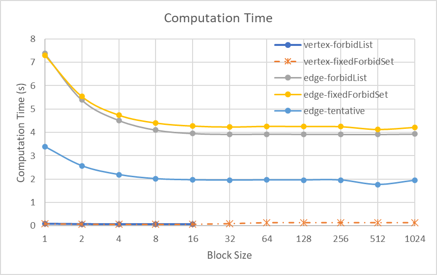

# Milestone Report

## Summary and Progress

Since our initial proposal, our project has changed. While we are still doing graph coloring, we switched to implementing a different algorithm designed for manycore architectures. Specifically we are implementing [1] in Cuda. Therefore the goals and deliverables mentioned in our initial writeup are no longer applicable.

So far we have completed the vertex based algorithm presented in [1] along with the edge based algorithm and several optimizations to each.

The vertex based algorithm works by continually assigning colors to vertices, finding conflicts caused by the assignment, and then assigning colors on those vertices to resolve conflicts, repeating until there are no conflicts left.

The edge based algorithms work differently. The major difference is that when detecting conflicts, we iterate over the edges rather than the vertices. And we do not maintain a conflicting vertex list. On each iteration of the loop, we first assign colors to vertices where those colors are not forbidden for those vertices. Then, over all the edges in parallel, we find all conflicting edges and resolve them by uncoloring one of the vertices and marking the color of the still colored vertex as forbidden for the now uncolored vertex. We stop when all vertices have been colored.

We have so far implemented an optimization to the vertex based algorithm which uses much less storage space for the list of forbidden colors for each vertex by only looking at a subset of colors at a time for each vertex. We have also implemented a similar optimization on the edge based algorithm.

Additionally, we have implemented an optimization on the edge based algorithm that reduces the number of edges that have to be examined in each round. It removes edges from the edge list which we know will no longer need to be processed in the future.

Our updated project schedule is on our main project page https://2025parallelgraph.github.io.

## Roadblocks

The major issue right now is the tentative coloring optimization. This optimization works by tentatively coloring vertices before we know their colors for sure. Our implementation of their tentative coloring algorithm never converges. We cannot find a bug in our program. We do not believe there to be any other significant roadblocks to completion besides the bug in tentative coloring.

We are beginning to suspect that the tentative coloring pseudo code provided in the paper is incorrect or omits a key detail. It should be noted that the authors appear to have cut content for space. They directly allude to leaving something out because of space considerations and the text fills exactly 10 pages without a single line left over. We plan to create a counter example to show that the presented algorithm does not work.

We have found a minor modification to the provided tentative coloring pseudo code that works although it sometimes slightly increases the number of colors.

## Data, Testing, and Poster Presentation

We have found several graph datasets. And we can see that our optimizations work but we have yet to do systematic tests of all versions and record their results for all graphs. Nor have we done the analysis. On our poster, we plan to show bar graphs or other data visualizations to show the differences in time and number of colors between our algorithms on various graphs. We will figure out more details when we do a full analysis.

## Preliminary Results

We tested our algorithms on graphs from [2], which are also used by [1]. For example, the computation time on graph *Bump_2911* is shown in the figure below.

Currently, we found that vertex-based algorithms are faster than edge-based algorithms. This is because they converge faster, and need fewer steps in each iteration. In the next 2 weeks, we plan to analyse the results, and try to optimize them further.

## References

[1] Deveci, Mehmet, et al. "Parallel graph coloring for manycore architectures." *2016 IEEE International Parallel and Distributed Processing Symposium (IPDPS)*. IEEE, 2016.

[2] Davis, Timothy A., and Yifan Hu. "The University of Florida sparse matrix collection." *ACM Transactions on Mathematical Software (TOMS)* 38.1 (2011): 1-25.